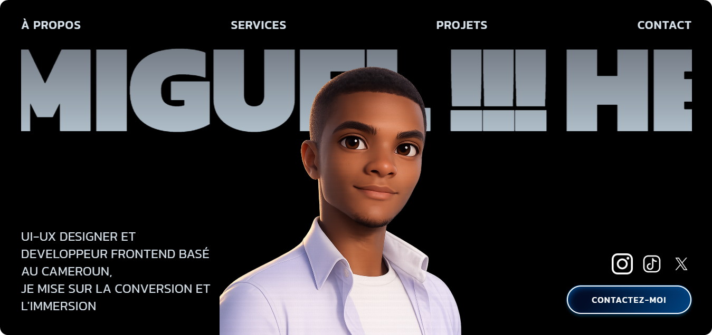

  <h1>👋 Salut, c'est MIGUELITO Design !</h1>
  
<b>UI/UX Designer & Frontend Engineer</b>

  
  
  

 

## 🚀 À propos de moi

Passionné par l'alliance entre le design visuel et le code, je suis **UI/UX Designer** et **Frontend Engineer**. Mon approche est résolument minimaliste et centrée sur l'utilisateur, avec une attention particulière portée sur la **conversion**, l'**immersion** et la **performance**.

- 🔭 Je conçois des interfaces modernes et je les intègre au pixel près.
- 🌱 **Mon focus :** Créer des expériences web fluides (SaaS, Landing pages, Web apps) qui répondent aux objectifs Business.
- 💡 J'aime transformer des idées complexes en solutions digitales simples, intuitives et esthétiques.
- 🎯 **Objectif :** Contribuer à des projets digitaux innovants et impactants.
- 📫 **Contact :** medjomarcelmiguel@gmail.com

---

## 🎨 Technologies & Outils de Design

  
### Design & Prototypage

### Frontend Engineering

### Backend (Full Stack mindset)

---

## 📊 Statistiques GitHub

  
  

  

---

## 🤝 Connectons-nous !

Retrouvez mon travail, mes maquettes et mes projets sur mes différents réseaux :

 

  

---

  
  
   
  <strong>🎨 Design with purpose. Code with passion.</strong>
   
  A votre service!!! par MIGUELITO Design

